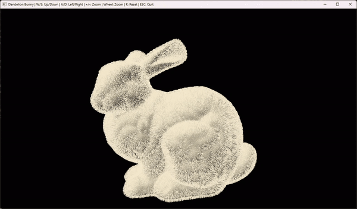

# Particle Bunny

Particle Bunny is a GPU-based 3D visualization project developed for the
Johns Hopkins University GPU Programming Specialization Capstone Project.

The application renders the Stanford Bunny using OpenGL and uses CUDA to
simulate fur strands on the GPU. Fur roots are generated across the Bunny's
surface, and CUDA updates the fur strand positions for real-time visualization.

<p align="center">
  
</p>

## Requirements

- Windows 11
- Visual Studio 2022
- CMake
- CUDA Toolkit 13.2
- NVIDIA GPU with CUDA support
- OpenGL 4.3-compatible GPU

## Stanford Bunny

This project uses the Stanford Bunny model from the Stanford University
Computer Graphics Laboratory.

Official Stanford 3D Scanning Repository:

https://graphics.stanford.edu/data/3Dscanrep/

The project uses the zippered reconstruction of the Stanford Bunny:

```text
Assets/bunny/reconstruction/bun_zipper.ply
```

The Stanford repository lists the zippered reconstruction as containing
35,947 vertices and 69,451 triangles.

## Build

Open the x64 Native Tools Command Prompt for Visual Studio 2022.

```bat
cmake -S . -B build -G "Visual Studio 17 2022" -A x64
cmake --build build --config Release
```

## Run

From the project directory, run:

```bat
.\build\Release\ParticleBunny.exe
```

The default configuration uses:

- Stanford Bunny PLY model
- 180,000 fur strands
- CUDA fur simulation
- OpenGL 4.3 rendering

## Command-Line Arguments

The application accepts command-line arguments when launching the program.

### Change the number of fur strands

Use `--particles` to change the number of fur strands generated by the
application.

```bat
.\build\Release\ParticleBunny.exe --particles <count>
```

Example:

```bat
.\build\Release\ParticleBunny.exe --particles 250000
```

The particle count must be between 1 and 300,000.

You can also combine command-line arguments:

```bat
.\build\Release\ParticleBunny.exe --model Assets/bunny/reconstruction/bun_zipper.ply --particles 250000
```

### Display command-line help

Use `--help` to display the available command-line options and simulation
controls.

```bat
.\build\Release\ParticleBunny.exe --help
```

## Camera Controls

Camera controls are available while the Particledelion Bunny simulation window
is open.

### Move the camera

Hold the following keys to move the camera:

- `W` - Move the camera upward
- `S` - Move the camera downward
- `A` - Move the camera to the left
- `D` - Move the camera to the right

For example, hold `W` to move the camera upward and hold `S` to move it
downward.

Hold `A` to move the camera left and `D` to move it right.

### Zoom

You can zoom using either the keyboard or mouse wheel.

- `+` - Zoom in
- `-` - Zoom out
- `Mouse Wheel Up` - Zoom in
- `Mouse Wheel Down` - Zoom out

For example, scroll the mouse wheel upward to move closer to the Bunny.
Scroll downward to move farther away.

### Reset the camera

Press:

```text
R
```

to return the camera to its default position.

### Exit

Press:

```text
ESC
```

to close the simulation.

## GPU / CUDA

The fur simulation is performed using CUDA on the NVIDIA GPU.

Each fur strand contains multiple points. The root point is attached to the
Bunny's surface while the remaining points extend outward to form the hair
strand.

CUDA updates the fur strands in parallel, allowing a large number of strands
to be simulated simultaneously.

When the application starts, it reports information about the CUDA device
being used.

Example:

```text
CUDA fur simulation initialized.
CUDA device: NVIDIA GeForce RTX 4070
Fur strands: 180000
Points per strand: 7
Total fur points: 1260000
Compute capability: 8.9
```

## Rendering

OpenGL is used for the visualization and rendering window.

The application uses:

- OpenGL 4.3
- GLFW for window and input management
- GLAD for OpenGL function loading
- GLM for vector and matrix mathematics
- CUDA for GPU fur simulation

The Bunny mesh is rendered as a triangle mesh.

The fur is represented as connected line strands. Each strand contains
7 points, which are connected using `GL_LINE_STRIP`.

## Fur Simulation

The fur system generates roots across the Bunny's surface rather than
placing independent particles around the model.

Each strand follows this structure:

```text
P0 -> P1 -> P2 -> P3 -> P4 -> P5 -> P6
```

Where:

```text
P0 = fur root attached to the Bunny
P1-P5 = intermediate strand points
P6 = fur tip
```

This allows the fur to appear as connected strands rather than floating
particles.

The fur root positions and surface normals are generated from the Bunny
mesh and passed to the CUDA simulation.

## Project Structure

```text
ParticleBunny/
├── Assets/
│   └── bunny/
│       └── reconstruction/
│           └── bun_zipper.ply
├── shaders/
│   ├── bunny.vert
│   ├── bunny.frag
│   ├── particle.vert
│   └── particle.frag
├── src/
│   ├── main.cc
│   ├── particle_sim.cu
│   ├── particle_sim.h
│   ├── ply_loader.cc
│   └── ply_loader.h
├── CMakeLists.txt
└── README.md
```

## Source Files

### `main.cc`

Contains the main application and rendering loop.

Responsibilities include:

- GLFW window creation
- OpenGL initialization
- GLAD initialization
- command-line argument parsing
- camera controls
- Stanford Bunny loading
- fur root generation
- OpenGL mesh rendering
- OpenGL fur rendering
- communication with the CUDA simulation

### `particle_sim.cu`

Contains the CUDA fur simulation.

Responsibilities include:

- CUDA device initialization
- GPU memory allocation
- fur strand simulation
- CUDA kernel execution
- updating fur positions
- returning fur positions for OpenGL rendering
- CUDA resource cleanup

### `particle_sim.h`

Contains the interface used by the main application to communicate with
the CUDA fur simulation.

### `ply_loader.cc`

Loads the Stanford Bunny PLY mesh and prepares its vertex and triangle data
for rendering and fur generation.

### `ply_loader.h`

Defines the mesh data structures and PLY loading interface.

## Current Implementation

The current implementation includes:

- Stanford Bunny PLY loading
- Surface-based fur root generation
- Configurable fur strand count
- CUDA-based fur simulation
- OpenGL rendering
- Real-time fur visualization
- Camera movement
- Camera zoom
- Camera reset
- Mouse-wheel zoom
- Command-line argument parsing
- Configurable model path
- Configurable fur strand count
- CUDA device reporting

## Future Work

Potential future improvements include:

- Improved fur density and softness
- More natural fur strand curvature
- Improved fur shading
- Wind and environmental forces
- Improved camera rotation
- More advanced fur rendering
- Additional GPU-based particle effects

## Challenges and Lessons Learned

One of the main challenges was generating fur strands that remain connected
to the Bunny's surface rather than behaving as independent particles.

The fur system uses the Bunny's surface positions and normals to generate
strand roots. Each strand contains multiple points, allowing CUDA to update
the points in parallel while maintaining the connection between the root and
the fur tip.

Another challenge was integrating CUDA simulation data with OpenGL rendering.
The CUDA simulation updates the fur positions on the GPU, while OpenGL uses
the resulting positions to visualize the strands.

This project provided experience with GPU parallelism, CUDA kernel execution,
GPU memory management, OpenGL rendering, and integrating CUDA computation
with an interactive graphics application.
